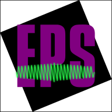
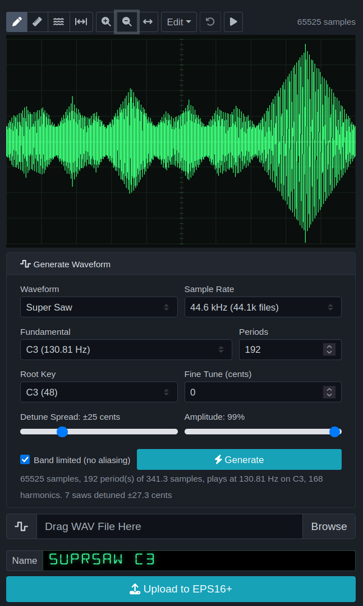

### EPSWave: Ensoniq EPS16+ Wavesample Utility
This a a browser-based utility to upload and download samples to and from the Ensoniq EPS16+ sampling sythesizer. In addition to loading and downloading samples, this version also allows for waveforms to be edited and basic waveforms to be synthesized within the browser, including the "Super Saw" found on the Roland JD-8000. 

Wavefiles loaded in will be analyzed for pitch and sample rates and should upload with these parameters set correctly such that you can begin playing the sample right away. 

### How to get started
[Navigate here to use the lastest version.](https://eliggett.github.io/EPSWave/)

or 

If you use Chrome, you can clone the repo and open the index.html file directly. For development purposes, a basic https server is included for testing (see [README_SERVER.md](server/README_SERVER.md))

### How to use
To be able to upload a wav file to the EPS16+ you need to: 
1. Enable web midi in your browser. When this works, you'll be able to select your midi hardware. 
2. Turn on MIDI Sysex support on the Ensoniq. You have to do this every time you power on -- Edit-->System-->many (15) arrow keys --> MIDI SYSEX --> ON (up)
3. Within the app's page, press "Create Instrument", "Create Layer", and then "Create Wavesample". You must do each one, in this order, or, you must load an existing instrument in that you wish to modify. These buttons are at the top of the page for your convenience. 
4. Press "Generate" to generate a starting wave for editing, or, press "Browse" and select a short sampled waveform. 
5. Edit the waveform for length and to remove clicks. The Edit menu has a lot of tools for this purpose. A one second wavesample at 44 KHz will take a minute or so to upload, so keep that in mind. Playback the waveform and verify it sounds as you expect. 
6. Press "Upload to EPS16+"
7. Go get lunch, return, and try it out. 

### Video Tutorial

[Overview of EPSWave](https://www.youtube.com/watch?v=KhIjxJBXTsc)

[Overview of how to use the original version (somewhat outdated but very useful demo)](https://youtu.be/-471osvR67s)

### Do you own an original EPS (not a 16 PLUS)?

We would like EPSWave to support the original EPS Classic, and we are four
questions short of being able to write it — questions no manual answers, because
Ensoniq's MIDI specification covers the 16 PLUS only. Answering them needs
someone with a Classic in front of them and about an hour.

If that is you, **[TESTING.md](TESTING.md)** walks through the whole thing from
the beginning. It is written for a musician rather than a programmer, it says
plainly which steps read and which one writes, and the write step affects only
the synth's memory — reloading from disk undoes it.

### Current Limitations and Bugs
1. You need a good midi interface, [some cheap interfaces do not work well with MIDI System Exclusive (sysex) content](https://llamamusic.com/fb01/index.html#cheapmidi). 
2. Firefox is picky about enabling web midi and may refuse if you are self-hosting or opening the file directly. Chrome is more forgiving. 
3. The Transwave functionality might need a bit of tuning. 
4. It is possible to create a wavsample which will not fit on a disk -- keep that in mind as you create. 
5. You must enable Sysex each time. If it's not working, check the synth's settings and then press "Test Connection". 

### Credit:  
- Original Project "EnsoniqEPS16Plus":
    - ['summitt' on Github](https://github.com/summitt/EnsoniqEPS16Plus/)
    - ['null0perat0r' on Patron](https://patreon.com/null0perat0r)
- Ensoniq VFD font (FIP 22AM5R 14-segment), SIL OFL 1.1 — see [fonts/EnsoniqVFD-OFL.txt](fonts/EnsoniqVFD-OFL.txt)
- LCD Font (compare / previous face): ['ctrlcctrlv' on Github](https://github.com/ctrlcctrlv/lcd-font)
- Ensoniq's MIDI Implementation Manual, available [here](reference/)
- Anthropic's Claude Opus 5, which was instrumental in digesting the original code and the complete midi implementation. Claude made it possible to add tremendous functionality over the course of just one afternoon. 

